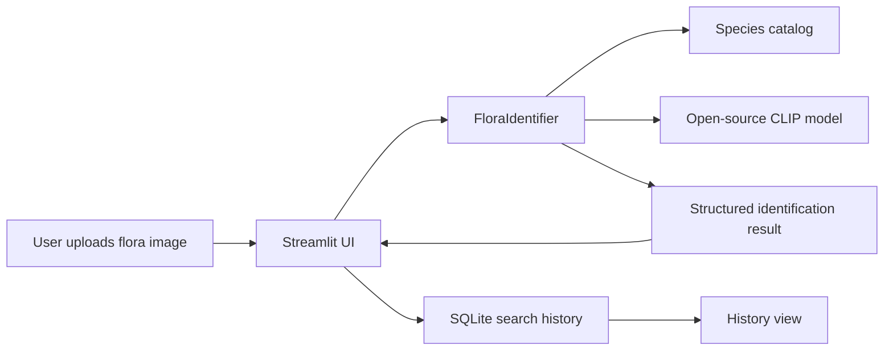

# Architecture

## Overview

FloraVision AI is a single Streamlit web application with modular Python services. Streamlit provides the website shell, while the `floravision` package handles model inference, catalog loading, persistence, and safety messaging.

## Components

## Responsibilities

- `app.py`: page setup, navigation menu, upload preview, result display, history display.
- `config.py`: environment-driven settings.
- `catalog.py`: loads and validates flora species metadata.
- `identifier.py`: image analysis, CLIP scoring, fallback scoring, confidence handling.
- `database.py`: SQLite schema, inserts, reads, and deletes.
- `safety.py`: required warnings and low-confidence copy.
- `styles.py`: light/dark UI styling.

## Data Flow

1. The user uploads a JPEG, PNG, or WebP image.
2. The UI previews the image and sends it to `FloraIdentifier`.
3. The identifier compares the image against flora catalog prompts.
4. The app displays common name, scientific name, confidence, category, summary, fun facts, toxicity caution, origin, habitat, regions, and similar-looking species.
5. The result is stored in SQLite with the image name and SHA-256 hash.
6. The history page reads recent records from SQLite.

## Open-Source AI Used

The primary model is `openai/clip-vit-base-patch32`. CLIP is a vision-language model that can compare an image with text labels, which makes it useful for starter zero-shot recognition. This app uses CLIP to score flora catalog prompts and return the most likely candidate.

## Scalability Notes

- The catalog is JSON for beginner friendliness, but it can move to a database table later.
- Model loading is cached with Streamlit resource caching.
- Search history is SQLite for local use; PostgreSQL would be a natural next step for multi-user deployment.
- The model service is isolated so a PlantCLEF or iNaturalist-trained model can replace CLIP without rewriting the UI.

